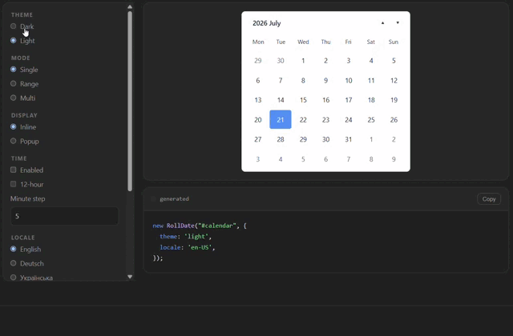

# RollDate (`@rolldate/core`)

JavaScript scrolling date picker — single / range / multi select, optional time picker (24h / 12h), light & dark themes. No framework required.

**Live demo:** https://rolldate-demo.vercel.app/  
**GitHub:** https://github.com/Abramov-Front-end/rolldate-core  
**MCP** (Cursor & other AI IDEs): [`@rolldate/mcp`](https://www.npmjs.com/package/@rolldate/mcp) · [repo](https://github.com/Abramov-Front-end/rolldate-mcp)

<p align="center">
  
</p>

> Preview assets: [`rolldate-demo.webm`](./assets/demo/rolldate-demo.webm) · [`rolldate-demo.gif`](./assets/demo/rolldate-demo.gif)

## Why RollDate?

- **Scroll-first UX** — wheel-style day/month/year and time columns; smooth on desktop and mobile
- **One picker, three modes** — single date, range, or multi-select without swapping libraries
- **Date + time** — optional footer time picker (24h or 12h AM/PM), configurable minute step
- **Popup or inline** — attach to an input or render inside any container
- **Light & dark** — built-in themes, no extra CSS framework
- **Small footprint** — ~52 KB minified JS (~13 KB gzip); no React/Vue/jQuery dependency
- **Runtime API** — open/close, disable dates, highlights, range presets, `goToDate`, `getValue` / `setValue`

## Install

```bash
npm install @rolldate/core
```

## Quick start (browser)

```html
<link rel="stylesheet" href="node_modules/@rolldate/core/dist/css/rolldate.min.css">
<input id="date-input" type="text" placeholder="Select date" autocomplete="off">
<script src="node_modules/@rolldate/core/dist/js/rolldate.min.js"></script>
<script>
  new RollDate('#date-input', {
    selectDate(date) {
      console.log(date);
    }
  });
</script>
```

## CDN (jsDelivr)

```html
<link rel="stylesheet" href="https://cdn.jsdelivr.net/npm/@rolldate/core@1/dist/css/rolldate.min.css">
<script src="https://cdn.jsdelivr.net/npm/@rolldate/core@1/dist/js/rolldate.min.js"></script>
```

## Bundler (ESM / CJS)

```js
import '@rolldate/core/css/min';
import RollDate from '@rolldate/core';

new RollDate('#date-input', { theme: 'dark' });
```

CSS path aliases: `@rolldate/core/css`, `@rolldate/core/css/min`, `@rolldate/core/styles`.

## TypeScript

```ts
import RollDate from '@rolldate/core';
import type { RollDateOptions } from '@rolldate/core';

const options: RollDateOptions = {
  theme: 'dark',
  selectType: 'range',
  enableTime: true,
};

new RollDate('#date', options);
```

Definitions ship with the package (`dist/js/rolldate.d.ts`).

## Common options

```js
new RollDate('#date-input', {
  theme: 'dark',          // 'light'
  selectType: 'single',   // 'range' | 'multi'
  enableTime: true,
  use12Hour: false,
  timeStep: 5,
  minDate: '01.01.2020',
  maxDate: '31.12.2030',
  closeOnSelect: true,
  highlightDates: [
    '12.08.2026',
    { date: '15.08.2026', colors: ['#22c55e', '#ef4444'] }
  ],
  rangePresets: [
    {
      label: '7 days',
      getRange(picker) {
        const start = picker.selectedDates[0] ?? picker.getViewDate();
        const end = new Date(start);
        end.setDate(end.getDate() + 6);
        return [start, end];
      }
    },
    {
      label: 'This month',
      getRange(picker) {
        const { year, month } = picker.getViewMonth();
        return [new Date(year, month, 1), new Date(year, month + 1, 0)];
      }
    }
  ],
  selectDate(date) {
    console.log(date);
  }
});
```

## Runtime methods (selection & navigation)

| Method | Description |
|--------|-------------|
| `open()` / `close()` | Popup visibility |
| `selectToday()` / `clearSelection()` | Built-in actions |
| `goToDate(date)` | Scroll calendar to a date (no selection change) |
| `getValue()` | `Date \| null` (single) or `Date[]` (range/multi) |
| `setValue(value)` | Set selection; `null` clears |
| `getViewMonth()` | `{ year, month }` — visible month after scroll |
| `getViewDate()` | First day of visible month |
| `setDisabledDates` / `disableDate` / `enableDate` | Disabled dates |
| `setHighlightDates` / `highlightDate` / `unhighlightDate` | Day markers |

Full API: https://rolldate-demo.vercel.app/docs

## What's new in 1.1.0

- Highlighted dates with optional colors and multiple dots per day (events / bookings)
- Range presets tied to **visible month** and **first selected date**
- Violet range fill styling (Today stays blue)
- `goToDate`, `getValue`, `setValue`, `getViewMonth`

See [CHANGELOG.md](./CHANGELOG.md).

## Package contents

| Path | Description |
|------|-------------|
| `dist/js/rolldate.min.js` | Minified script (browser default) |
| `dist/js/rolldate.js` | Full script |
| `dist/css/rolldate.min.css` | Minified styles |
| `dist/css/rolldate.css` | Full styles |
| `assets/demo/rolldate-demo.webm` | Preview video (WebM) |
| `assets/demo/rolldate-demo.gif` | Preview animation (GIF) |

## Support

Questions or issues: **rolldate.support@gmail.com**

## License

MIT
---

## Source

This repository is the **public release mirror** of `@rolldate/core`.
Development happens in a private monorepo; releases are synced here for npm and GitHub.

- npm: https://www.npmjs.com/package/@rolldate/core
- Demo: https://rolldate-demo.vercel.app/
- MCP: https://github.com/Abramov-Front-end/rolldate-mcp
