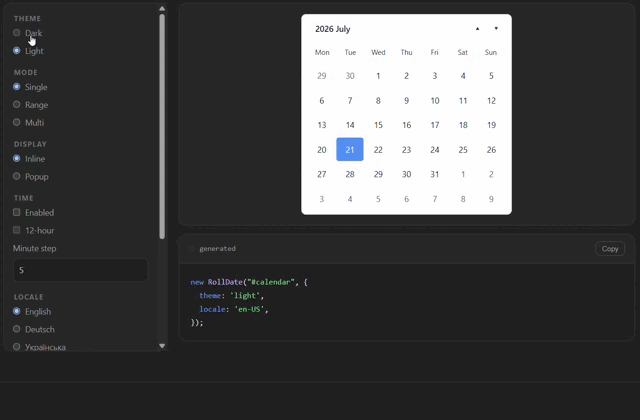

> **⭐ If RollDate saves you time, [star the repo](https://github.com/Abramov-Front-end/rolldate-core)** — it helps others discover it.  
> **[Live demo](https://rolldate.dev/)** · **[Docs](https://rolldate.dev/docs)** · **[Product Hunt](https://www.producthunt.com/products/rolldate?launch=rolldate)** · **[Issues & feedback](https://github.com/Abramov-Front-end/rolldate-core/issues)**

# RollDate (`@rolldate/core`)

JavaScript scrolling date picker — single / range / multi select, optional time picker (24h / 12h), **main** / dark / light themes. No framework required.

**Live demo:** https://rolldate.dev/  
**GitHub:** https://github.com/Abramov-Front-end/rolldate-core  
**MCP** (Cursor & other AI IDEs): [`@rolldate/mcp`](https://www.npmjs.com/package/@rolldate/mcp) · [repo](https://github.com/Abramov-Front-end/rolldate-mcp)

## RollDate ecosystem

Need a full event calendar instead of a date picker?

**RollDate Events** is a zero-dependency JavaScript event calendar with Month, Week, Day and Agenda views, continuous navigation, responsive layouts, and TypeScript support.

- [RollDate Events](https://rolldate.dev/events)
- [Live demo](https://rolldate.dev/events/demo)
- [GitHub](https://github.com/Abramov-Front-end/rolldate-events)
- [npm](https://www.npmjs.com/package/@rolldate/events)

<p align="center">
  
</p>

> Preview assets: [`rolldate-demo.webm`](./assets/demo/rolldate-demo.webm) · [`rolldate-demo.gif`](./assets/demo/rolldate-demo.gif)

## Why RollDate?

- **Scroll-first UX** — wheel-style day/month/year and time columns; smooth on desktop and mobile
- **One picker, three modes** — single date, range, or multi-select without swapping libraries
- **Date + time** — side panel or bottom bar with scrollable rolls; 12h AM/PM toggle; `timePosition: 'right' | 'bottom'`
- **Popup or inline** — attach to an input or render inside any container
- **Three themes** — `main` (default), `dark`, `light` — no extra CSS framework
- **Small footprint** — ~54 KB minified JS (~14 KB gzip); no React/Vue/jQuery dependency
- **Runtime API** — open/close, `enabledDates` / `disabledDates` rules, highlights, range presets, `goToDate`, `getValue` / `setValue`

## Install

```bash
npm install @rolldate/core
```

## Quick start (browser)

```html
<link rel="stylesheet" href="node_modules/@rolldate/core/dist/css/rolldate.min.css">
<input id="date-input" type="text" placeholder="Select date" autocomplete="off">
<script src="node_modules/@rolldate/core/dist/js/rolldate.min.js"></script>
<script>
  new RollDate('#date-input', {
    selectDate(date) {
      console.log(date);
    }
  });
</script>
```

## CDN (jsDelivr)

```html
<link rel="stylesheet" href="https://cdn.jsdelivr.net/npm/@rolldate/core@1/dist/css/rolldate.min.css">
<script src="https://cdn.jsdelivr.net/npm/@rolldate/core@1/dist/js/rolldate.min.js"></script>
```

## Bundler (ESM / CJS)

```js
import '@rolldate/core/css/min';
import RollDate from '@rolldate/core';

new RollDate('#date-input', { theme: 'main' });
```

CSS path aliases: `@rolldate/core/css`, `@rolldate/core/css/min`, `@rolldate/core/styles`.

## TypeScript

```ts
import RollDate from '@rolldate/core';
import type { RollDateOptions } from '@rolldate/core';

const options: RollDateOptions = {
  theme: 'main',
  selectType: 'range',
  enableTime: true,
  use12Hour: true,
  timePosition: 'right',
};

new RollDate('#date', options);
```

Definitions ship with the package (`dist/js/rolldate.d.ts`).

## Common options

```js
new RollDate('#date-input', {
  theme: 'main',          // 'dark' | 'light'
  selectType: 'single',   // 'range' | 'multi'
  enableTime: true,
  use12Hour: true,
  timePosition: 'right',  // 'bottom' — mobile always bottom
  timeStep: 5,
  scrollSpeed: 1,       // 0.7 slower, 1.5 faster, 0 = arrows/keyboard only
  minDate: '01.01.2020',
  maxDate: '31.12.2030',
  enabledDates: [{ repeat: 'weekly', weekdays: [0, 6] }], // allowlist; omit to allow all
  disabledDates: ['26.12.2026'], // denylist, always wins
  closeOnSelect: true,
  highlightDates: [
    '12.08.2026',
    { date: '15.08.2026', colors: ['#22c55e', '#ef4444'] }
  ],
  rangePresets: [
    {
      label: '7 days',
      getRange(picker) {
        const start = picker.selectedDates[0] ?? picker.getViewDate();
        const end = new Date(start);
        end.setDate(end.getDate() + 6);
        return [start, end];
      }
    },
    {
      label: 'This month',
      getRange(picker) {
        const { year, month } = picker.getViewMonth();
        return [new Date(year, month, 1), new Date(year, month + 1, 0)];
      }
    }
  ],
  selectDate(date) {
    console.log(date);
  }
});
```

Priority: `minDate` / `maxDate` → `enabledDates` (allowlist, if set) → `disabledDates` (denylist, always wins). ISO `YYYY-MM-DD` is a local calendar day, not UTC.

## Runtime methods (selection & navigation)

| Method | Description |
|--------|-------------|
| `open()` / `close()` | Popup visibility |
| `selectToday()` / `clearSelection()` | Built-in actions |
| `goToDate(date)` | Scroll calendar to a date (no selection change) |
| `getValue()` | `Date \| null` (single) or `Date[]` (range/multi) |
| `setValue(value)` | Set selection; `null` clears |
| `getViewMonth()` | `{ year, month }` — visible month after scroll |
| `getViewDate()` | First day of visible month |
| `setEnabledDates(rules?)` | Replace the allowlist; `undefined` turns it off, `[]` blocks every date. Non-array values are ignored |
| `setDisabledDates` / `disableDate` / `enableDate` | Denylist rules. `enableDate` removes only an exact date entry — it cannot override weekly/monthly/range/callback rules |
| `setHighlightDates` / `highlightDate` / `unhighlightDate` | Day markers |

Full API: https://rolldate.dev/docs

## What's new in 1.3.1

- **`--rd-on-accent`** — override text/icon color on filled accent, range endpoints, and primary buttons
- Theme colors are CSS variables on `.RollDate__container` — see [CSS variables](https://rolldate.dev/docs/css-variables)

## What's new in 1.3.0

- **`enabledDates` allowlist** — exact dates, inclusive ranges, weekly/monthly repeats, or callbacks. Omit the option to allow all dates; `[]` blocks every date
- **`setEnabledDates`** — change the allowlist at runtime without recreating the picker (`undefined` turns it off). Invalid non-array values keep the current allowlist
- **`disabledDates`** — same rule types as the allowlist, and always wins (so you can allow weekends and close a holiday)
- **`scrollSpeed`** — wheel/touch speed (`1` default; `0` = arrows and keyboard only)
- Calendar scroll no longer jumps the page, trims the popup, or snaps back to the current month when availability rules change

## What's new in 1.2.4

- Keyboard-accessible day grid (`<button>`, roving tabindex, arrow/`Page` keys, `Escape`)
- Popup restores focus to the opening input after select (`closeOnSelect`) and after `Escape`
- Localized previous/next month labels and `aria-pressed` on selected days

## What's new in 1.2

- **`main` theme** — new default look (blue accent); calendar + time side by side on desktop
- **Redesigned time picker** — scrollable hour/minute rolls with AM/PM segmented toggle (no separate time readout)
- **`timePosition: 'right' | 'bottom'`** — time beside the calendar or below it; on mobile (≤640px) always below
- **`footerButtons[].variant`** — `'primary'` | `'secondary'` for styled footer actions
- **Layout polish** — calendar width unchanged when time is on the right; footer separator only when footer buttons are set
- **README demo GIF** — updated playground preview (themes, time, generated code)

See [CHANGELOG.md](./CHANGELOG.md) for 1.2.0 / 1.2.1 details and earlier releases.

## What's new in 1.1.4

- Smooth animated navigation when clicking calendar prev/next arrows
- Official site and docs at https://rolldate.dev/

## What's new in 1.1.0

- Highlighted dates with optional colors and multiple dots per day (events / bookings)
- Range presets tied to **visible month** and **first selected date**
- Violet range fill styling (Today stays blue)
- `goToDate`, `getValue`, `setValue`, `getViewMonth`

See [CHANGELOG.md](./CHANGELOG.md).

## Package contents

| Path | Description |
|------|-------------|
| `dist/js/rolldate.min.js` | Minified script (browser default) |
| `dist/js/rolldate.js` | Full script |
| `dist/css/rolldate.min.css` | Minified styles |
| `dist/css/rolldate.css` | Full styles |
| `assets/demo/rolldate-demo.webm` | Preview video (WebM) |
| `assets/demo/rolldate-demo.gif` | Preview animation (GIF) |

## Support

Questions or issues: **rolldate.support@gmail.com**

## License

MIT
---

## Source

This repository is the **public release mirror** of `@rolldate/core`.
Development happens in a private monorepo; releases are synced here for npm and GitHub.

- npm: https://www.npmjs.com/package/@rolldate/core
- Demo: https://rolldate.dev/
- MCP: https://github.com/Abramov-Front-end/rolldate-mcp
